# Eye|Contribute - CPD Diary
(Developer: David Trevaskis)

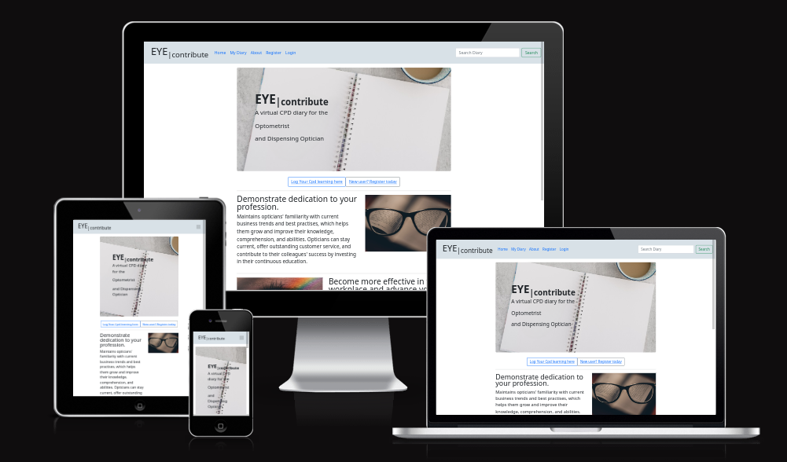

**Live Site:**

[Live webpage](https://cpddiary-bd5599156530.herokuapp.com/)

**Link to Repository:**

[Repository](https://github.com/DaveTrev/p4-Django-diary)

**Developed by: David Trevaskis**

## Introduction

Introduction

Eye|Contribute Cpd Diary is a simple online diary to log continued education for Dispensing Opticians and Optometrists in Ireland. Under the regulatory body CORU, each member must keep a diary of all learning carried out in a year.

On registration with Eye|Contribute, it allows each user to create a personal journal of their learning activities and track their cpd credits in a easy to follow centralised manner.
Each diary entry, covers the information required by CORU, such as time spent and activities undertaken.

Users can set up an account that allows them to add, edit and delete entries. 
The project was designed as the 4th portfolio project of the Code Institutes Full Stack Diploma Program. It was built using

-   Django
    
-   Python
    
-   Js
    
-   CSS
    
-   HTML
    
-   Postgresql

### Project Goals

The goal of the project was to fulfil a need (and want) in my life as a Dispensing Optician, to build an easy to use online diary for logging continued learning for optical professionals.
Each diary entry must have the correct layout as required by the regulations set out by CORU.
The site allows users to register and create private diary entries, the purpose, to collate and log all learning undertaken in a simple to use digital diary.
Each diary enter is private to that specific user, only they can create, edit or delete entries.
My main objective was to make this  as mobile friendly as possible, enabling users to log conversations, topics they have encountered on their day in practice easily. 

### Data Base Design

The Entity Relationship Diagram (ERD) shows the database's structure, which is essential to this site's functionality:

.png)

A User Model is provided by Django, Allauth is used to handle registration and user authentication. The custom model "Entry" is used to log entries to the CPD diary.

The fields required by the Entry model is as follows.

-   Date (Automatically generated from the day of entry)
    
-   Title
    
-   Learning outcome
    
-   Activity type
    
-   Cpd credits
    
-   Time spent
    
-   Impact on practice.

A `User` Model is provided by Django, and the `Entry Model` stores the details of users CPD diary entries. The user can add many additions to their diary, in order to store notes to refer back to should they need it. 

The `Entry` model is based on the personal diary walkthrough project by Real Python. However, the models were significantly altered to fit the needs of this project. The `Entry` model has added fields of 'Learning Outcome', 'Activity Type, 'Time Spent', 'Cpd Credits' and 'Practice Impact'. 

**Future Models**

In the future, the developer would like to add additional models, a custom user profile, allowing users to tailor their personal details on the site.

As part of the entry model, the developer would like to add an additional feature of uploading supporting documents to the diary database, to provide evidence and reference for the user.

### Wireframe

Initial Wireframes

## Agile Methodology

The Agile Methodology was used to plan this project. This was implemented through Github and the Project Board which can be seen here -

[Project Board Link](https://github.com/users/DaveTrev/projects/3)

Through the use of the Kanban board in the projects view in Github, the project was divided into a few different sections:

* To do
* In Progress
* Done
* Future Updates

User Stories and any other project-related fixes or updates were created using Github issues.

8 enhancement features or features I would liek to add were not completed and left as Future updates to complete.

## User Stories

* As a website user, I can:

1. As a "site user " I can register on "the site" to access features and diary.
2. As a "site user" I can see multiple options to register for the site and what its use it.
3. As a "site user " I read up on what is required with logging CPD.

* As an authenticated website user, I can:

1. As a "site user " I can create a new diary entry in the cpd log
2. As a "site user" I can edit the diary entries
3. As a "site user" I can see the previous entries made
4. As a "site user" I can delete the diary entries

**Epic 1: User Authentication**

-   User Story 1: As a site user, I want to register on the site to access features and the diary.
    
    -   Task 1: Install Allauth
    -   Task 2: Style registration and login pages
    -   Task 3: Implement user registration functionality
  

**Epic 2: Diary Entry Management**

-   User Story 2: As a site user, I want to create a new diary entry in the CPD log.
    
    -   Task 1: Create the diary entry form
    -   Task 2: Implement diary entry creation functionality

-   User Story 3: As a site user, I want to edit my diary entries.
    
    -   Task 1: Create the diary entry editing page
    -   Task 2: Style the diary entry editing page
    -   Task 3: Implement diary entry editing functionality

-   User Story 4: As a site user, I want to see my previous diary entries.
    
    -   Task 1: Create a page to display previous diary entries
    -   Task 2: Style the diary entry display page
    -   Task 3: Implement functionality to fetch and display previous entries

**Epic 3: Site Navigation**

-   User Story 5: As a user, I want clear navigation to find the information I need.
    -   Task 1: Create a responsive navigation bar using Bootstrap
    -   Task 2: Add relevant links to the navigation bar
    -   Task 3: Test the navigation bar's responsiveness
    -   Task 4: Adjust the navigation bar for logged-in users

**Epic 4: Error Handling**

-   User Story 6: As a developer, I want to create status error templates to secure views and notify users of issues.
    -   Task 1: Create 404, and 500 error pages extending from Base.html
    -   Task 2: Style the error pages

**Epic 5: Documentation**

-   User Story 7: As a developer, I want to create documentation for fellow developers.
    -   Task 1: Write a site overview
    -   Task 2: Write a table of contents
    -   Task 3: Write sections for the table of contents
    -   Task 4: Create GIFs/screenshots of the site

**Epic 8: Testing**

-   User Story 8: As a developer, I want to create TESTING.md files.

    -   Task 1: Complete HTML, CSS, JS, and Python validation
    -   Task 2: Complete manual testing
    -   Task 3: Create screenshots for TESTING.md

**Epic 9: Deployment**

-   User Story 9: As a developer, I want to set up Django and deploy the project on Heroku.
    -   Task 1: Install Django
    -   Task 2: Create project
    -   Task 3: Create environment variables and secure them in env.py
    -   Task 4: Create an app on Heroku
    -   Task 5: Edit config vars
    -   Task 6: Link Heroku to the GitHub repository

**Epic 10: Site Design**

-   User Story 10: As a developer, I want to design a visually appealing homepage.
    -   Task 1: Design the homepage to match the site theme

**Epic 11: User Management**
-   User Story 11: As a developer, I want to provide account/profile creation functionality.

    -   Task 1: Using AllAuth, handle user registration
    -   Task 2: Implement user registration, login, and logout functionality

-   User Story 17: As a user, I want to sign up, log in, and log out to access features available to registered users.
    
    -   Task 1: Style signup, login, and logout pages
    -   Task 2: Implement user authentication functionality

**Epic 13: Footer**

-   User Story 18: Create a footer containing social links to the developer.

**Epic 14: Kanban Board**

-   User Story 19: Set up a Kanban board to track project tasks.

#### Target Audience
The target audience is a Dispensing Optician or Optometrist who wants to keep a record of their learning, experiences and impressions of their learning in a succinct form. This site / app is used to keep all records in a easy to use format, accessable on mobile or desktop.

#### User Requirements and Expectations

- An easy-to-use navigation system and layout.
- Simple access to all of the site's features.
- All features and links operate as intended.
- Instant feedback on performance while using site features.
- An attractive responsive design.
– Accessibility.

**Easy and Clear User Interface**

- Check that the navigation menu is simple to use and operates as intended.
- Check that the page names correspond to the expected content.
- Assist the user in exploring the site's capabilities by providing visual feedback.
- Design something that reflects the page's purpose.

**Relevant information**

- Include information about the site's intent to help users understand it.

**Principal Website Functions**

- Add a log-in feature that enables user interaction with the website.
- Add the registration, login, and logout features so users can access the essential site features.
- Create a form to add entries to the log.
- Add the ability to modify and delete log entries.

**Responsiveness**

- Use responsive design for seamless access on desktop, tablet, and mobile devices.

## Structure

The website is divided into 3 pages with content depending on whether the user is authenticated or not.

- **Home Page** is visible to both types of users.  it will feature a call to action to register or login to access the site. Unauthenticated users will also see a banner calling them to register
- **Register Page** allows the user to create an account to access the core functionality of the site.
- **Login/Logout Pages** allow the user to authenticate or log out of their account.
- **Add Diary Entry Page** allows an authenticated user to add a log entry to their Diary.
- **User Entries Page** allows authenticated user to see all their entrys, the date they were made and the associated cpd points claimed.
- **Diary Entry Detail Page** allows the user to view all the details of the relevant CPD diary entry , if they are authenticated and it is their post they will see buttons that allow them to access the edit or delete features. 
- **About Page** allows an authenticated or Unauthenticated user to read more on CPD requirements and access links to relevant professional bodies for further reading

### Surface

#### Colour Scheme

The site is designed to light on images, I wanted to keep a very clean / professional approach to the site design, to try and ensure quick page loads and unobtrusive site navigation.

In general, the colour palette is kept in relatively neutral so it lets the features of the site stand out and not distract the user

#### Font

For lengthy texts like those found in books, magazines, and webpages, Times New Roman is a great choice because of its high readability.
Times New Roman is a serif typeface. Serif fonts are frequently connected to tradition, authority, formality, and comfort.
Times New Roman's narrow shape makes it possible to fit more text per page, which is primarily why businesses choose it.
Times New Roman's use in academic papers and official documents, as well as its relationship with tradition and authority, can assist a website project a sense of competence and professionalism.

## Existing Features

### Header and Navigation

Navbar with logo, page name, links and search bar (for use with diary). Different links are visible for unauthenticated users and authenticated. Active links are rendered in black as opposed to the default grey. On small to medium screens the navigation links are displayed as a collapsible burger menu.

***
***

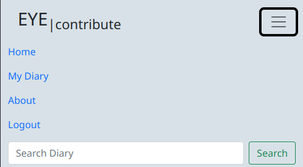

### Footer

- Footer with a copyright feature links to several of the developer's pages, and a notice that this is for educational use only.
- Footer is similar on all screen sizes.

### Account Features

**Create an account**

- Allows a user to sign up
- Fields include Username, Email (optional), Password, and Password confirmation

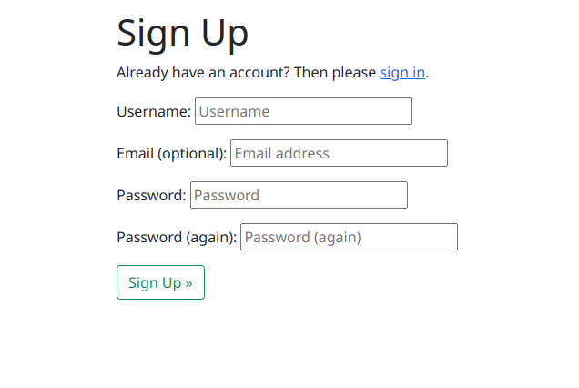

**Login to an account**

- Allows a user to access their information

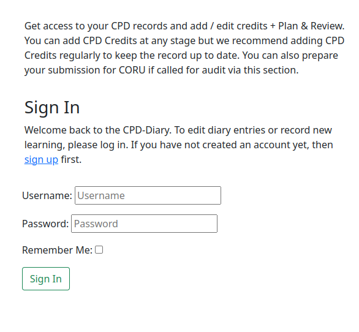

**Log out of an account**

- Allows a user to exit their account

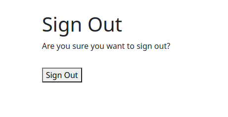

### Main Views

**Home Page**

The navbar will change if a user is logged in or not, the call to action of log in or register remain unchanged on the home page.
The cards with images help to explain why the user may want to access the site.

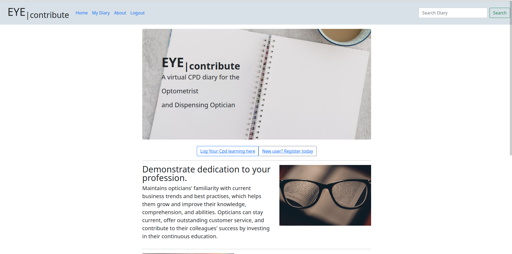

***
***

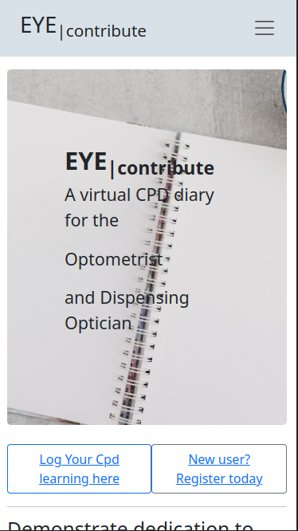

**Entry List**

The entry list / diary main view, lets users see previous entries, the date they were made and the points claimed. If enough entries are made the view will paginate.

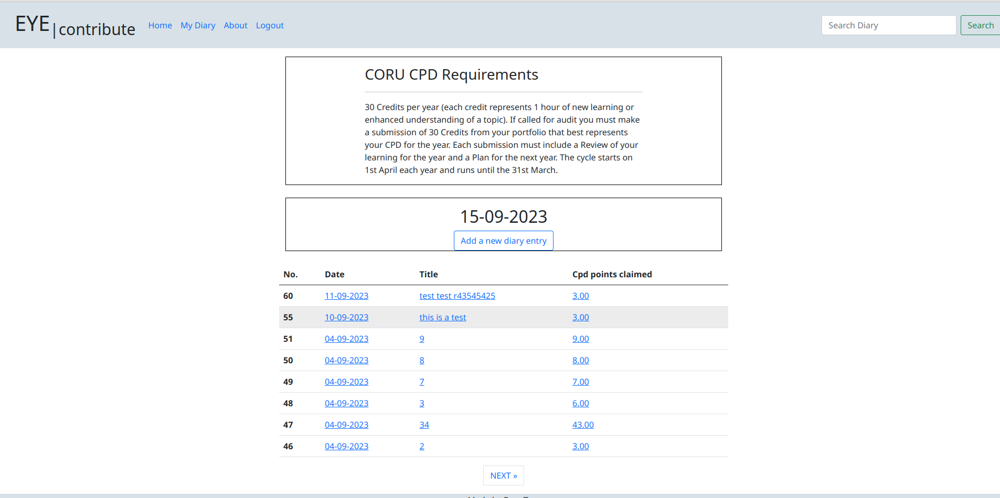

***
***

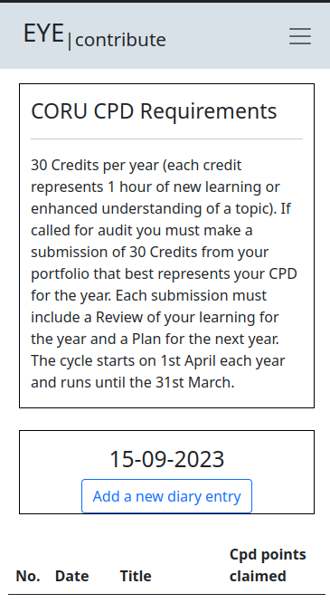

**Entry Detail**

On click into a diary entry, the user can see the details of their diary entry, from this page they can also access editing and deletion options.

***
***

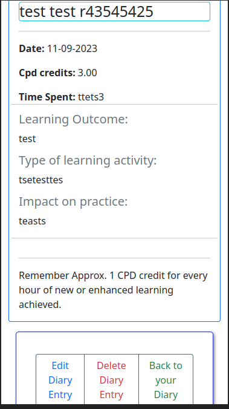

### CRUD Functionality

All CRUD functionality is only available to registered users once they are logged in.

**Log Entry form**

The log entry form allows registered / logged in users (only) to post new diary entries

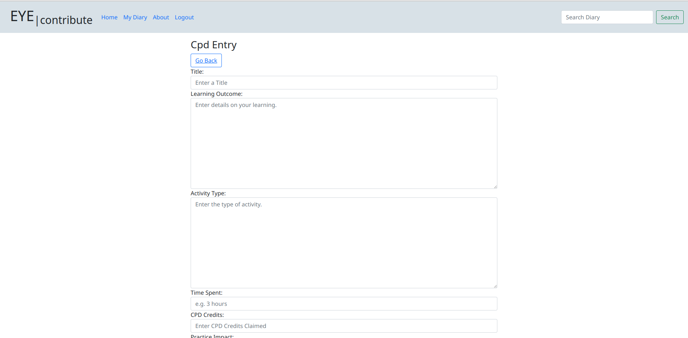

***
***

**Edit Entry form**

The Edit log entry form allows registered / logged in users to post edit previous diary entries

***
***

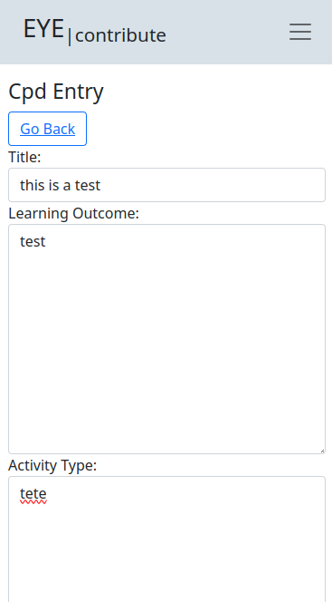

**Delete a Log Entry**

Permit the user to delete a record. When deleting an entry, the user will be asked to confirm their decision.

### Success Messages

Every time a user carries out a function on the website, either as part of the account functionality or the CRUD functionality, a success message will be displayed confirming that the function was carried out successfully.

## Future Features

1. **Edit Profile** -
Creating functionality to allow the user to customise their details, position, practice details, education, CORU no. etc

2. **Upload Supporting documentation** -
To give the users an option to upload images of notes / supporting documentation to add to their diary entries. 

3. **Retrieve Password Feature** -
For a more comprehensive user experience, a function that enables the user to recover or reset their password if they have lost or forgotten it should be added.

4. **Google Login** -
   Allowing users to register and log in using Google would add ease of use for the user.

5. **Improve Search bar functionality ** -
At the present the search bar is working but on deletion of text in the field, the diary list does not refresh

6. **Collate CPD logs for a year to download ** -
If called to show learning over a year, an option to download and print diary entries would provide greater functionality for the user.

7. **A Contact form to organise learning days / Calendar for upcoming events** -
Adding a page that allows a user (unregistered / registered) to contact the site admin to propose meetups / learning days.
Adding to this page, a calendar to display events for the given month 

## Technologies Used

### Languages

- HTML - used as the main language to set up the structure of the website.
- CSS - used to customize the styling of the website.
- JavaScript - used to manipulate the DOM on various pages.
- Python - used to set up the core functionality of the site, such as models, and views.

### Python Modules/Packages used:

Several core packages were used, a few of the most important ones are listed here together with their functions:

- django - high-level Python web framework used to develop this application/site.
- psycopg2 - PostgreSQL database adapter for the Python programming language.
- dj3-cloudinary-storage - facilitates integration with Cloudinary by implementing Django Storage API.
- django-allauth - Integrated set of Django applications addressing authentication, registration, account management as well as 3rd party (social) account authentication.
- crispy-boostrap4 - Bootstrap4 template pack for django-crispy-forms.

### Frameworks & Tools

- Django - used to set up the back-logic and user model on the website.
- GitHub - used to host the source code of the website. Also contains the record of the Agile development framework set up to plan the project, using issues, milestones, and projects on GitHub.
- Gitpod - used to write and develop the code for the website, and for committing and pushing code to GitHub.
- Heroku - used for live website deployment.
- Cloudinary - is a cloud storage solution for website media and other static files. It also allows for the manipulation and optimization of media delivery.
- Bootstrap - used throughout the site for responsiveness, layout, and predefined style elements.
- Wireframepro - used to create wire-frames of the site planning
- Lucid Chart - used for creating the ERD.
- Font Awesome - used for icon features on the site.
- Canva - used to generate the color scheme.
- cleanup.pictures - to remove the pencil from the landing page image.
- iloveimg.com - to crop images for the readme
- stackedit.io - Editing Markdown

## Testing and Validation

The testing documentation can be found at [TESTING.md](TESTING.md)

## Deployment & Development

### Deploy on Heroku

**Requirement and Procfile**

Before deployment on Heroku, two files need to be created and be up to date, a `requirements.txt` file and a `Procfile`.

- The `requirements.txt` file is created by executing the following command in the terminal window: ` pip3 freeze --local > requirements.txt`. A file with all requirements will be created.
- Then create a file named `Procfile` and insert the following code: `web: gunicorn worldtravels.wsgi`, with no empty lines after it.
- Then make sure to push these files to your repository.

**Creating Heroku App**

- Log into Heroku and go to the Dashboard.
- Click "New" and then select "Create new app".
- Give your app a name and select the region closest to you.
- Click "Create app" to confirm.

**Creating a database**

- Log into ElephantSQL.com and access your dashboard.
- Click "Create New Instance"
- Set up a plan, give your plan a **Name**, select the **Tiny Turtel (Free)** plan, leave the **Tags** field blank.
- Select "Select Region" and select a data center new you.
- Click "Review".
- Confirm your details and then click "Create instance".
- Return to the ElephantSQL dashboard and click on the database instance name for this project.
- In the URL section, click the copy icon to copy the database URL.
- In your workspace make sure django and gunicorn are installed by running `pip3 install 'django<4' gunicorn`.
- Equally make sure that infrastructure for the database is installed by running `pip3 install dj_database_url===0.5.0 psycopg2`.
- Update the `requirements.txt` file if needed.

**The env.py file**

- If you do not have a `env.py` file in your workspace create one and make sure it is included in the `.gitignore` file.
- At the top of the `env.py` file add the line: `import os`.
- Below that add the following two lines:

  `os.environ["DATABASE_URL"] = "<copied URL from SQL database>"`  
  `os.environ["SECRET_KEY"] = "<create a secret key of your own>"`  

- If you are using Cloudinary storage also add the following line:  

  `os.environ["CLOUDINARY_URL"] = "<copied URL from Cloudinary account>"` 

- Make sure the environment variables are imported correctly into the `settings.py` file.
- Run `python manage.py migrate` in the terminal window to migrate the data structure to the database instance.

**Setting Environment Variables**

- On the Heroku Dashboard select the app you just created and then select the "Settings" tab.
- Click "Reveal Config Vars"
- Add the following config vars:  

  `DATABASE_URL` - copy the database URL from ElephantSQL in here, it should also be in the `env.py` file.  
  `SECRET_KEY` - copy your secret key in here.  

- If you are using Cloudinary storage you also need to copy your personal `CLOUDINARY_URL` into these fields.  
- In addition, you may need the key `PORT` with value `8000`.

**Connecting to GitHub and Deploy**

- On the Heroku Dashboard select the app you just created and then select the "Deploy" tab.
- Select GitHub for the deployment method.
- Search for the name of the project repository and click "Connect".
- Further down the page, select "Enable Automatic Deploys" if desired.
- Then finally further down, select "Deploy Branch" and watch the app being built.

### Forking the Repository

- Log in to GitHub and locate the GitHub repository you want to fork.
- At the top of the Repository above the "Settings" Tab on the menu, locate the "Fork" Button and click it.
- You will have a copy of the original repository in your GitHub account.
- You will now be able to make changes to the new version and keep the original safe.

### Making a Local Clone

- Log into GitHub and locate the repository you want to clone.
- Click the 'Code' dropdown above the file list.
- Copy the URL for the repository.
- Open Git Bash in your IDE.
- Change the current working directory to the location where you want the cloned directory.
- Type `git clone` in the CLI and then paste the URL you copied earlier. This is what it should look like:
  `$ git clone https://github.com/`
- Press Enter to create your local clone.

You will need to install all of the packages listed in the requirements file you can use the following command in the terminal `pip install -r requirements.txt` which will do it for you.

## Credits

### Media

All images are taken from unsplash.com
- https://unsplash.com/photos/wpi3sDUrSEk

- https://unsplash.com/photos/G1iYCeCW2EI

- https://unsplash.com/photos/ZI2Lv7jxmEM

- https://unsplash.com/photos/6qThS1x6P6A

- https://unsplash.com/photos/AjcVTjCz310

- https://unsplash.com/photos/57USw1-h50k

- https://unsplash.com/photos/jgPcjw2tBVc

### Code

Resources and inspiration came from a few sources:

- The initial setup of the project the Code Institute's 'I Think Therefore I Blog' Django walkthrough project was used to get started with the code.
- Several guides were of great help and inspiration to the developer in guiding the implementation of functionality in line with the requirements of PP4 and reaching the MVP stage:
  - <a href="https://www.youtube.com/watch?v=llbtoQTt4qw">Dennis Ivy Django Todo app</a>
  - <a href="https://realpython.com/django-diary-project-python/">Real Python Diary App</a>
  - <a href="https://www.dennisivy.com/django-class-based-views">Dennis Ivy Class Based Views</a>
  - <a href="https://ordinarycoders.com/blog/article/django-user-register-login-logout">Login Logout How to</a>
  - <a href="https://github.com/URiem/worldtravellog"> A fantastic readme from Uriem as a guide / deployment guide taken from this source </a>
  
  Throughout the project, the following helpful websites were often frequented for troubleshooting:
  - <a href="https://docs.djangoproject.com/en/4.2/">Django documentation</a>
  - <a href="https://stackoverflow.com">Stack Overflow</a>
  - <a href="https://www.w3schools.com/">W3 Schools</a>
  - <a href="https://developer.mozilla.org/">mdn web docs</a>

For information on CPD points, I have taken directly from source, some text on the site is taken directly from the CORU site and FAQ.
- https://www.coru.ie/health-and-social-care-professionals/education/continuing-professional-development/cpd-audit/
- https://www.coru.ie/health-and-social-care-professionals/education/continuing-professional-development/cpd-faqs/
- https://www.coru.ie/files-education/cpd/orb-guidance-on-continuing-professional-development.pdf
- https://www.coru.ie/files-education/cpd/orb-support-for-continuing-professional-development.pdf

Below are links I have used, I am conscious to include all links, to avoid any unwarranted plagerism. This project was the toughest yet and I know ive pulled from alot of resources:

- added all auth instead of from django.contrib.auth.views import LoginView
https://django-allauth.readthedocs.io/en/latest/

- Create about page with model / possible seperate app
https://www.dennisivy.com/django-class-based-views

- Creating user registration, login and logout with django
https://ordinarycoders.com/blog/article/django-user-register-login-logout

- CRUD
https://www.geeksforgeeks.org/django-crud-create-retrieve-update-delete-function-based-views/?ref=lbp

- Working with forms 
https://docs.djangoproject.com/en/3.1/topics/forms/#working-with-form-templates

- Mixin messages
https://www.youtube.com/watch?v=pOXqvzVCeSM

- Mixin messages with class based views
https://docs.djangoproject.com/en/3.2/ref/class-based-views/mixins-single-object/#django.views.generic.detail.SingleObjectMixin.get_context_data

- getbootstrap
https://getbootstrap.com/

- Bootstrap cheat sheet
https://getbootstrap.com/docs/5.0/examples/cheatsheet/

- Bootstrap grid system
https://www.youtube.com/watch?v=Wqu-d_b3K-0

- User specific pages
https://stackoverflow.com/questions/70749958/user-specific-page-in-todo-list

- get queryset
https://stackoverflow.com/questions/46846198/django-class-based-view-with-get-queryset

- getcontext data
https://medium.com/@hassanraza/when-to-use-get-get-queryset-get-context-data-in-django-952df6be036a#:~:text=get_context_data(),to%20display%20in%20your%20templates.

- get context data 2
https://rasulkireev.com/django-get-context-data/

- get context data 3
https://stackoverflow.com/questions/49027544/how-to-properly-use-get-context-data-with-listview-to-fetch-related-instances-init 

- get context data 4
https://www.valentinog.com/blog/get-context-data/

- class based views - dennis ivy
https://www.dennisivy.com/django-class-based-views

- Django for beginners (A fantastic book)
https://djangoforbeginners.com/

- Defensive design
https://forum.djangoproject.com/t/how-to-restrict-django-staff-user-to-edit-or-delete-others-staff-user-post-from-admin-panel/7887/5

- Defensive design 2
https://stackoverflow.com/questions/72980454/defensive-programming-for-delete-function-in-views-django

- Crispy forms how to
https://www.youtube.com/watch?v=MZwKoi0wu2Q

- Fade out with js 
https://stackoverflow.com/questions/6121203/how-to-do-fade-in-and-fade-out-with-javascript-and-css

- Fade out with Js 2
https://jsfiddle.net/sunnypmody/XDaEk/

- pagination with class based views
https://dontrepeatyourself.org/post/django-pagination-with-class-based-view/

- pagination with filtering
https://www.caktusgroup.com/blog/2018/10/18/filtering-and-pagination-django/

- pagination -> with filter and search
https://stackoverflow.com/questions/64618631/how-to-filter-and-paginate-in-listview-django

- 404 page (how to)
https://www.geeksforgeeks.org/django-creating-a-404-error-page/

- Form validation
https://www.dark-hamster.com/application/how-to-display-form-error-in-django/

- Crispy forms how to 
https://www.youtube.com/watch?v=MZwKoi0wu2Q&t=369s

- Styling forms with bootstrap 
https://www.youtube.com/watch?v=6-XXvUENY_8

- add all auth instead of from django.contrib.auth.views import LoginView
https://django-allauth.readthedocs.io/en/latest/

## Acknowledgements

I would like to thank:

- As always, many many thanks to my better half Jenny and my kids Rose and Ollie for their ongoing patience while I worked on this project and disappeared for weeks.
- To my fatihful dog Ziggy, who helps me get out the door on many a walk, decompressing and figuring problems out while away from the coalface.
- My colleagues Claire and William, who took time to test and send on feedback, likewise my good friend Twist, who may not be an Optom or a DO but help provide valueable feedback aswell
-  I would like to thank my mentor [Jubril Akolade](https://github.com/Jubrillionaire) whos support and patience helped guide me through this project.
- My fellow students in no particular order [Paul Gleeson](https://github.com/Shaga-Matula), [Indrek Mannik](https://github.com/Inc21), [Lornavav](https://github.com/Lornavav) (Not forgetting Brendan and Darragh too) for all the advice, support and picking apart the puzzles that coding presents. 
- Cohort facilitator Paul Thomas O'Riordan, for their general advice and support through out this course. 
- The invaluable Slack community and tutors at tutor support, really helping in times of need.